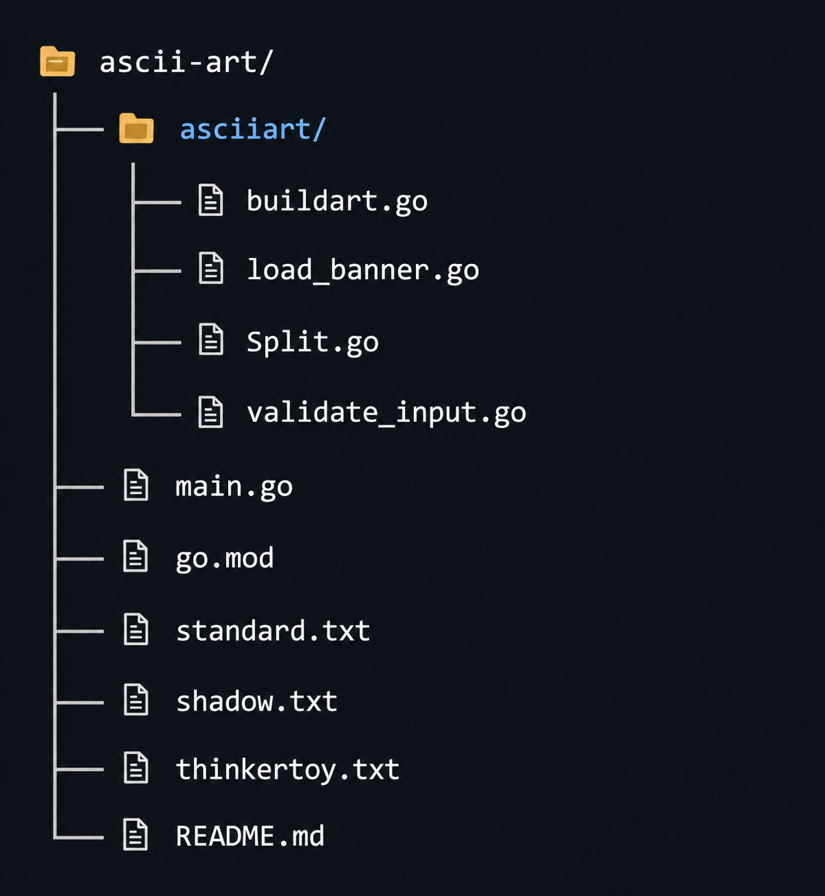

# ASCII Art Generator

This project is a command-line tool written in Go that converts input text into ASCII art using different banner styles. You can choose from multiple banner files (`standard`, `shadow`, `thinkertoy`) to render your text in various ASCII art fonts.

## Features
- Converts plain text into ASCII art using banner files.
- Supports multiple banner styles.
- Handles multi-line input using the `\n` escape sequence.
- Validates input to ensure only printable ASCII characters are processed.
- Simple command-line interface.

## Error Handling
If the banner file is missing, empty, or incomplete, an error is displayed.
If the input contains invalid characters, an error message is shown.

## Extending
To add more banner styles, simply add another .txt file in the same format as the existing banners and reference it as the second argument.

## Project Structure

# Project documentation

## Usage

### 1. Build and Run

You need Go installed (version 1.22.2 or higher).

### Bash
go run . "YourTextHere" standard

The first argument is the text you want to convert.
The second argument is the banner style: standard, shadow, or thinkertoy.

### Example:
go run . "Hello\nWorld!" "shadow"

This will print "Hello" and "World!" in ASCII art using the shadow banner.

### 2. Arguments
If you provide fewer than 2 arguments, the program will prompt you to enter the correct usage.
If you provide more than 2 arguments, the program will display an error.
### 3. Banner Files
The banner files (standard.txt, shadow.txt, thinkertoy.txt) must be present in the project root. Each file contains ASCII art representations for printable characters.

## How It Works
### Input Validation:
The input string is validated to ensure all characters are printable ASCII (32–126). The special sequence \n is used for line breaks.

### Banner Loading:
The selected banner file is loaded and parsed into lines.

### ASCII Art Building:
The input is split on \n, and each line is converted to ASCII art using the loaded banner data.             

### Error Handling
If the banner file is missing, empty, or incomplete, an error is displayed.
If the input contains invalid characters, an error message is shown.

### Extending
To add more banner styles, simply add another .txt file in the same format as the existing banners and reference it as the second argument.